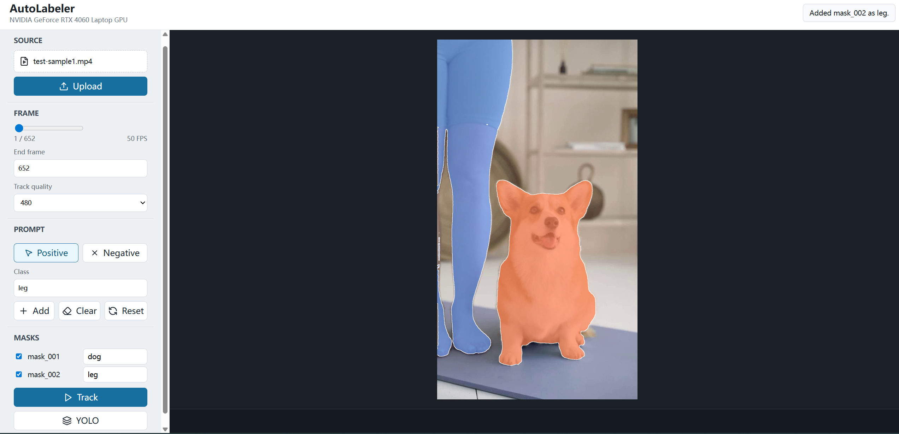
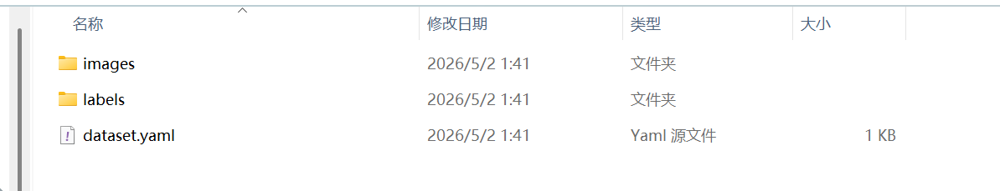
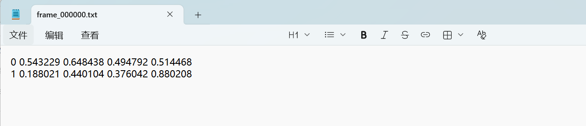

# AutoLabeler

[中文文档](README.zh-CN.md)

## Introduction

**AutoLabeler** is a video object auto-labeling tool that quickly generates YOLO-format object detection datasets from videos.

Built upon [Track-Anything](https://github.com/gaomingqi/Track-Anything), this project retains its core SAM click-to-segment + XMem video tracking capabilities, with extensive modifications focused on **labeling efficiency** — including YOLO dataset export, frame sampling, video preprocessing, coordinate remapping, and performance optimizations. Simply click positive/negative points on the starting frame to obtain a target mask, and the system will propagate the target across subsequent frames and convert the tracking results into a dataset ready for YOLO training.

## Environment Setup

A Conda environment with Python 3.10 is recommended. Verified environment:

```
Python 3.10.20
PyTorch 2.7.1+cu118
CUDA 11.8
GPU: NVIDIA GeForce RTX 4060 Laptop GPU
```

Create the environment:

```bash
conda create -n autolabeler python=3.10 -y
conda activate autolabeler
```

Install PyTorch with CUDA 11.8:

```bash
python -m pip install torch torchvision torchaudio --index-url https://download.pytorch.org/whl/cu118
```

Install project dependencies:

```bash
pip install -r requirements.txt
```

Verify PyTorch and CUDA:

```bash
python -c "import torch; print(torch.__version__); print(torch.version.cuda); print(torch.cuda.is_available()); print(torch.cuda.get_device_name(0))"
```

If `torch.cuda.is_available()` returns `True`, the GPU environment is ready.

## Model Weights

Place model weights under `checkpoints/`.

| Model                  | Purpose                                                    |
| ---------------------- | ---------------------------------------------------------- |
| SAM (Segment Anything) | Click-to-segment — user clicks on a frame, SAM generates a mask |
| XMem                   | Video tracking — propagates the mask frame by frame        |

If the weight files are missing, the backend will attempt to download them automatically. Since the files are large, it is recommended to place them in advance to avoid long waits on startup or first upload.

## Usage

Start the backend:

```bash
conda activate autolabeler
cd /d E:\Work\AutoLabeler
python app.py
```

Backend default address:

```
http://127.0.0.1:8000
```

Start the frontend:

```bash
cd /d E:\Work\AutoLabeler\frontend
npm install
npm run dev -- --host 0.0.0.0
```

Frontend default address:

```
http://127.0.0.1:5173
```

### Workflow

1. Upload a video.
2. Select the start and end frames.
3. Choose the tracking resolution: original / 720 / 480 / 360 (affects tracking accuracy, VRAM usage, and speed).
4. Use Positive / Negative clicks on the target region to generate a SAM segmentation result.
5. Confirm the mask and click **Add** to save the target.
6. Select the masks to track.

   

7. Click **Track** to generate the tracking result video.

   

8. Click **YOLO** to export a YOLO-format dataset archive.

   

   

## Project Structure

```
AutoLabeler/
├── app.py                            # Entry point, starts the FastAPI server
├── requirements.txt                  # Python dependencies
├── backend/                          # Backend core
│   ├── server.py                     # FastAPI REST API & session management
│   ├── track_anything.py             # SAM + XMem facade class
│   ├── video_processor.py            # Video transcoding, coordinate mapping, frame sampling
│   ├── sampled_dataset_generator.py  # Sampled-frame YOLO dataset generator
│   ├── efficient_dataset_generator.py# Full-frame YOLO dataset generator (with coordinate remapping)
│   ├── demo.py                       # Standalone metaseg demo script
│   ├── tools/                        # SAM wrappers & visualization
│   │   ├── base_segmenter.py         #   SAM model loading & predict
│   │   ├── interact_tools.py         #   Click interaction controller (SamControler)
│   │   ├── painter.py                #   Mask/point visualization
│   │   └── mask_painter.py           #   Mask painting (distance transform mode)
│   ├── tracker/                      # XMem video tracking
│   │   ├── base_tracker.py           #   Tracking interface, wraps InferenceCore
│   │   ├── config/config.yaml        #   XMem inference config
│   │   ├── inference/                #   Inference core & memory management
│   │   │   ├── inference_core.py     #     Per-frame inference loop
│   │   │   ├── memory_manager.py     #     Working memory + long-term memory management
│   │   │   └── kv_memory_store.py    #     KV memory store
│   │   ├── model/                    #   XMem network architecture
│   │   │   ├── network.py            #     XMem main model (encode_key/encode_value/segment)
│   │   │   ├── modules.py            #     Encoder, decoder, KeyProjection, etc.
│   │   │   ├── resnet.py             #     ResNet with extra input channels
│   │   │   ├── group_modules.py      #     Multi-object grouped conv/upsampling
│   │   │   ├── cbam.py               #     Channel + spatial attention module
│   │   │   ├── aggregate.py          #     Multi-object probability soft aggregation
│   │   │   ├── memory_util.py        #     Similarity computation, softmax, readout
│   │   │   ├── losses.py             #     Training losses (Dice + BootstrappedCE)
│   │   │   └── trainer.py            #     Distributed training wrapper
│   │   └── util/                     #   Utilities
│   │       ├── mask_mapper.py        #     Index mask ↔ one-hot conversion & label remapping
│   │       ├── range_transform.py    #     ImageNet normalization
│   │       └── tensor_util.py        #     Padding/unpadding, IoU
│   ├── inpainter/                    # E2FGVI video inpainting (disabled, code retained)
│   │   ├── base_inpainter.py         #   Inpainting interface, loads E2FGVI-HQ
│   │   ├── config/config.yaml        #   Inpainting inference config
│   │   ├── model/                    #   E2FGVI network architecture
│   │   │   ├── e2fgvi.py             #     Standard generator + discriminator
│   │   │   ├── e2fgvi_hq.py          #     HQ version (variable resolution)
│   │   │   └── modules/              #     Sub-modules
│   │   │       ├── feat_prop.py      #       Bidirectional feature propagation
│   │   │       ├── flow_comp.py      #       SPyNet optical flow estimation + flow_warp
│   │   │       ├── tfocal_transformer.py      # Standard temporal focal Transformer
│   │   │       ├── tfocal_transformer_hq.py   # HQ temporal focal Transformer
│   │   │       └── spectral_norm.py          # Spectral normalization
│   │   └── util/
│   │       └── tensor_util.py        #   Frame/mask scaling utilities
│   └── stub_mmcv/                    # mmcv stub module to prevent import errors
│       └── mmcv.py
├── frontend/                         # React frontend
│   └── src/
│       ├── main.tsx                  #   Frontend application entry
│       └── styles.css                #   Styles
├── scripts/                          # Utility scripts
│   ├── check_gpu.py                  #   GPU/CUDA environment check
│   ├── quick_test_coordinates.py     #   Coordinate conversion verification
│   ├── performance_comparison.py     #   Generator performance comparison
│   ├── backup_project.py             #   Source code backup
│   ├── backup_project_full.py        #   Full backup (including weights)
│   ├── quick_backup.py               #   Interactive backup menu
│   └── backup_manager.py             #   Backup management (list/delete/restore)
├── tests/                            # pytest tests
│   ├── test_video.py                 #   Video processing tests
│   ├── test_video_processor.py       #   VideoProcessor tests
│   ├── test_sampled_generator.py     #   Sampled generator tests
│   ├── test_track.py                 #   SAM + XMem integration tests
│   └── test_app_function.py          #   Upload/init workflow tests
├── checkpoints/                      # SAM and XMem model weights
├── result/                           # Tracking result output
├── temp_uploads/                     # Uploaded video temp directory
├── temp_videos/                      # Transcoded video cache
├── temp_yolo_datasets/               # YOLO dataset export directory
└── test_sample/                      # Sample videos
```

## License

 [MIT ](LICENSE).
